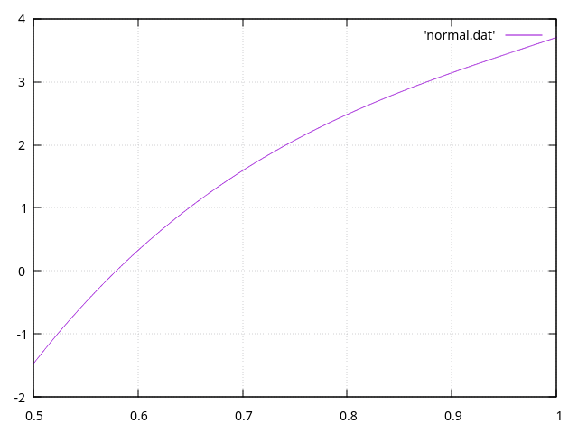
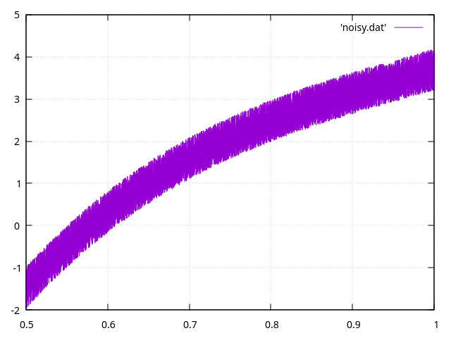
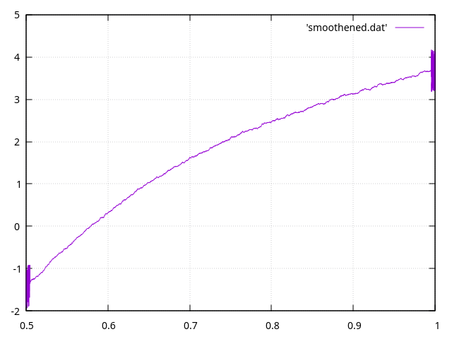

# Function Smoothener

- Function smoothener for college assignment.
- Uses weighted moving average.
- License: GNU

## Running The Code:

```bash
$ make run # Build and run the project.
$ make build # Build the project.
$ make graph # View the graphs of the normal, noisy, and smoothened function.
```

## Graphs:

Normal Function:



Noisy Function:



Smoothened Function:


