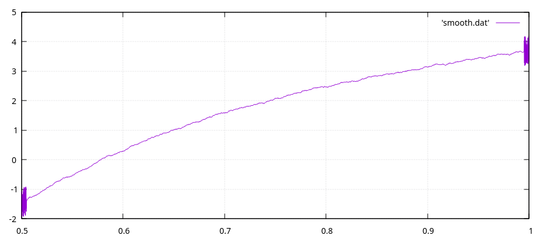

# Function Smoother

- Function smoother for college assignment.
- Uses weighted moving average.
- License: GNU

## Running The Code:

```bash
$ make run # Build and run the project.
$ make build # Build the project.
$ make graph # View the graphs of the normal, noisy, and smoothed function.
```

## Graphs:

Normal Function:


Noisy Function:


Smoothed Function:


